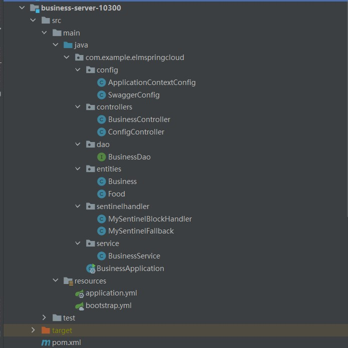
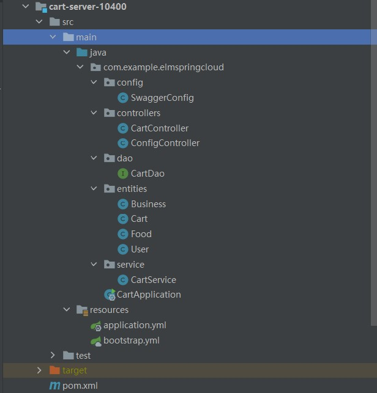
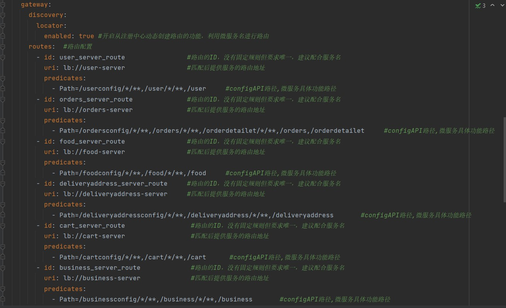
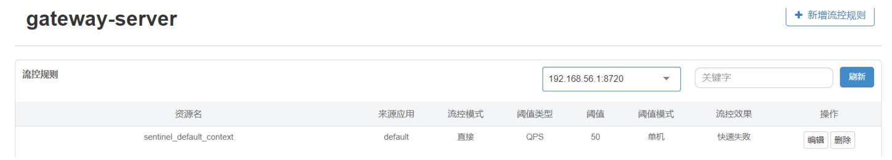
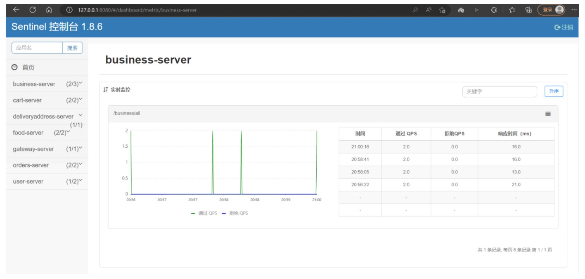

# 软件服务工程
## 龚尹鸿杰 （20201050449）
### 项目整体架构图
- 
### 后端
* 主要技术：Spring Cloud 2022.0.0、Spring Boot 3.0.2、Sentinel 1.8.6、Nacos 2.2.1、MYSQL 8.0.32(运行在 CentOS 8.5 平台上)主从复制、 hibernate、jpa、knife4j-springdoc-ui
* Spring Cloud项目结构目录文件：
- 
* 主要实现微服务项目结构：
1. api-commons:通用的类文件，包含实体entity层、dao层、service层、controller层的通用的抽象类与接口，以及一些工具类。
- 
2. 商家微服务集群项目文件及目录。
- 
- 
3. 购物车微服务集群项目文件及目录。
- 
- 
4. 送货地址微服务项目文件及目录。
- 
5. 食品微服务集群项目文件及目录。
- 
- 
6. 订单微服务集群项目文件及目录。
- 
- 
7. 用户微服务项目文件及目录。
- 
8. 网关gateway微服务项目文件及目录。
- 
- 
9. mysql数据库主从配置。
- 
- 
10. Nacos 2.2.1启动及相关内容。
- 
- 
- 
11. Sentinel-dashboard-1.8.6。
- 
- 
- 
- 
- 
- 
- 
- 
- 
- 
- 
- 
- 
- 
- 
- 
12. API文档。
- 
13. 所有微服务启动后的截图。
- 

### 前端
* 主要技术：angular、TypeScript。
* 项目结构目录：
  
* 主要实现：
1. 创建angular项目，配置tailwind到angular项目中。
`·ng new my-project`
` cd my-project`
`npm install -D tailwindcss postcss autoprefixer`
 `npx tailwindcss init`
   
   

2. 在app-routing.module.ts中配置路由。
```  
const routes: Routes = [
   {path:'',pathMatch:"full",redirectTo:"login"},
   {path:'businessinf',component: BusinessInfComponent},
   {path:'businesslist',component: BusinessListComponent},
   {path:'historicalorders',component: HistoricalOrdersComponent},
   {path:'index',component: IndexComponent},
   {path:'login',component: LoginComponent},
   {path:'order',component: OrderComponent},
   {path:'payment',component: PaymentComponent},
   {path:'register',component: RegisterComponent},
   ];
@NgModule({
imports: [RouterModule.forRoot(routes)],
exports: [RouterModule]
})
export class AppRoutingModule { }
```  
3. 创建service服务,使不同页面组件可以调用service中访问后端api的方法。
   `ng generate service`
4. 在service编写访问api的方法。例如：
```
//用户登录
dologin(name:string,password:string){
let me=this;
  //默认是observe: 'body', responseType: 'json'，可以不用写
  const httpsoption={headers:new HttpHeaders({'Content-Type':'application/json',observe: 'body', responseType: 'json'})};
  var url=this.baseurl+'/pub/auth/auth-token';
  var mybody={
  "username": name,
  "password": password,
  "tokenType": "info",
  "grant_type": "password",
  "client_id": "oauth_isolationArea",
  "Access-Control-Allow-Origin": "*"
  };
  this.http.post(url,mybody,httpsoption).subscribe((response:any)=>{
  this.authusername = response.username;//获取responese的json中的属性
  const retoken = response.accessToken;//获取responese的json中的属性
  console.log(response);
  this.token=retoken;
  localStorage.setItem("mytoken", this.token);
  localStorage.setItem("authusername", this.authusername)
  console.log(this.token)
  me.router.navigate(['/index']);
  },
  (error) => {
  console.log("Some error in catch");
  if (error.status === 401 || error.status === 403){
  this.logininf="用户名或密码错误";
  me.router.navigate(['/login']);//验证失败，继续跳转至登录页面
  }
  }
  );
  }
```    
6. 创建页面组件，将tailwind页面迁移至此项目中。`ng generate component`
7. 对每个页面编写TypeScript，同时使用**MVVM**对页面中的内容进行双向绑定。
8. 运行结果展示。
    - 登录页面
    
    - 注册页面
    
    - 首页面
    
    - 商家列表页面
    
    - 商家详情页面
    
    - 订单页面
    
    - 支付页面
    
    - 历史订单页面
    


